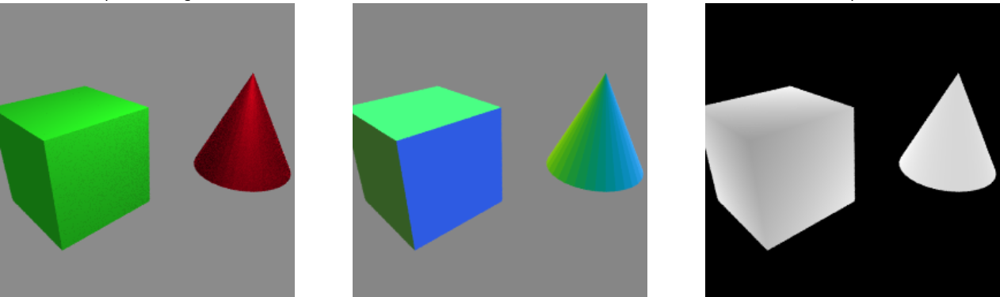

.. toctree::
    :hidden:

    example_1
    example_2
    example_3
    api

Fauxton
=======

Fauxton is a software library designed to leverage computer graphics technology for computer vision applications. It provides simple interfaces to the `Blender <http://www.blender.org/>`_ animation system and the `Open Shading Language <http://www.openshading.com/>`_. Fauxton supports reading and writing Blender scenes, photorealistic rendering, and precise, automated annotation. It also provides a mechanism for serializing instances of user-defined resource types via Blender's native format.

Installation
------------
Fauxton depends on Blender 2.71+, `NumPy <http://www.numpy.org/>`_ (for array handling), and `OpenCV <http://opencv.org/>`_ (for transferring HDR images between processes). To install these dependencies on Ubuntu:

.. code::

    sudo apt-add-repository ppa:irie/blender
    sudo apt-get update
    sudo apt-get install blender python-numpy python-opencv

Fauxton itself can be installed by copying the source files into your site-packages directory. To install Fauxton on Ubuntu:

.. code::

    wget -q https://github.com/MasonMcGill/fauxton/archive/master.zip
    unzip master.zip -d master
    sudo mv master/fauxton-master/fauxton /usr/lib/python2.7/dist-packages
    rm -rf master.zip master

Examples
--------
- :doc:`example_1`
- :doc:`example_2`
- :doc:`example_3`

Click here to view the full :doc:`api`.
